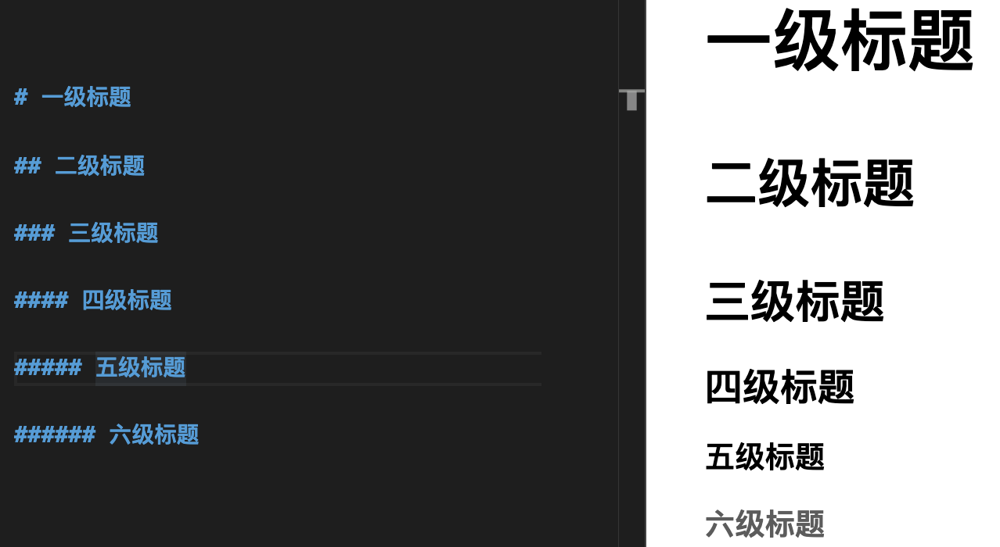
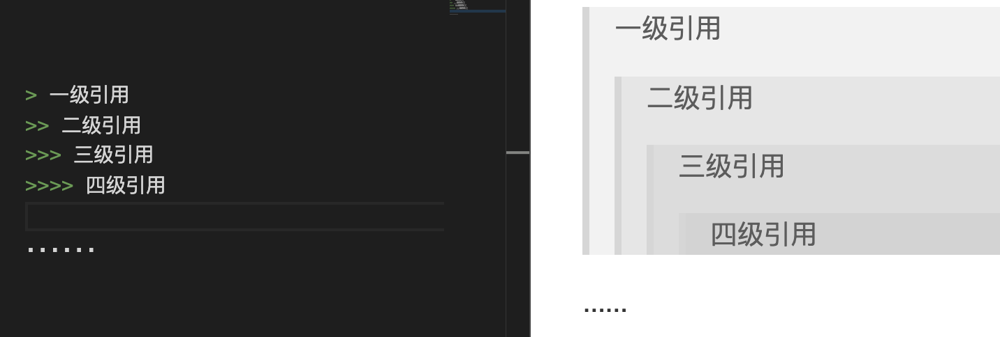

# Markdown

> **Markdown是一种可以使用普通文本编辑器编写的标记语言，通过简单的标记语法，它可以使普通文本内容具有一定的格式。[百度百科](https://baike.baidu.com/item/markdown)**

推荐编辑器[**VSCode**](https://code.visualstudio.com/)，推荐插件

* [**Markdown Preview Enhanced**](https://marketplace.visualstudio.com/items?itemName=shd101wyy.markdown-preview-enhanced) 作用是可以实时预览效果

* [**Markdown PDF**](https://marketplace.visualstudio.com/items?itemName=yzane.markdown-pdf) 作用是可以导出html，pdf，png等


## 标题

每篇文章都少不了标题。在 Markdown 中，标题独占一行，行首用1~6个 **#** 号表示如下图所示

```
# 一级标题
## 二级标题
### 三级标题
#### 四级标题
##### 五级标题
###### 六级标题

效果如下
```

# 一级标题
## 二级标题
### 三级标题
#### 四级标题
##### 五级标题
###### 六级标题


<!--  -->


## 引用

```
> 一级引用
>> 二级引用
>>> 三级引用

......

效果如下
```

> 一级引用
>> 二级引用
>>> 三级引用

<!--  -->


## 插入图片

```


效果如下
```


## 链接


```
[显示文本](链接URL)

效果如下
```

[**百度一下**](https://www.baidu.com/)

## 列表


```
* 苹果
* 梨
* 葡萄
* ......

效果如下
```

* 苹果
* 梨
* 葡萄


